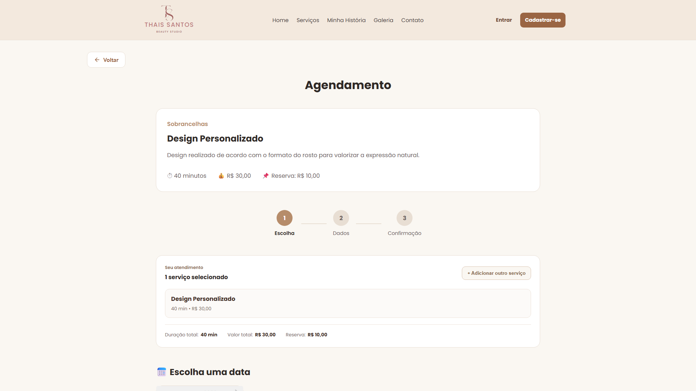

# BeautyFlow

<p align="center">
  
</p>

Sistema completo de gestão, atendimento e agendamento online para estúdios de beleza.


---

## Sobre o projeto

O **BeautyFlow** foi criado para reunir a experiência pública, a jornada da cliente e a operação administrativa de um estúdio de beleza em uma única aplicação. A versão 1.0 atende inicialmente o Thaís Santos Beauty Studio e preserva **Beauty Studio** como a identidade apresentada ao público.

Seus principais objetivos são:

- oferecer agendamento online com disponibilidade real;
- disponibilizar uma área segura para a cliente;
- centralizar a rotina no painel administrativo;
- acompanhar reservas, recebimentos, despesas e resultados financeiros;
- administrar promoções e comunicações;
- relacionar a galeria ao catálogo de serviços;
- preparar lembretes, resumos e outras automações operacionais.

---

## Demonstração

O fluxo público pode ser conhecido pelas telas reais abaixo, capturadas localmente sem credenciais ou dados pessoais. A demonstração animada será adicionada após a homologação.

## Interface

### Serviços


### Agendamento



---

## Funcionalidades

### Área Pública

- Home institucional, história e contato.
- Catálogo de serviços com detalhes, duração, benefícios e valores.
- Galeria responsiva com fotos, vídeos e serviços relacionados.
- Cadastro, login e recuperação de senha.
- Agendamento e cancelamento por fluxo protegido.

### Área da Cliente

- Meu Espaço com visão geral dos atendimentos.
- Próximos agendamentos e histórico de serviços realizados.
- Detalhes, cancelamento e solicitação de remarcação.
- Solicitação e resposta de encaixe.
- Atualização de dados e preferências da conta.

### Área Administrativa

- Dashboard com resumo diário, agenda e pendências.
- Agenda diária, semanal e mensal.
- Gestão de clientes, serviços, solicitações e configurações.
- Análise de comprovantes e acompanhamento de cancelamentos.
- Feriados, bloqueios, horários especiais e liberação mensal.
- Conclusão manual, não comparecimento e experiência diária.
- Checklist de primeiro acesso para preparação administrativa do estúdio.

### Automações

- Lembretes de atendimento.
- Resumo diário administrativo.
- Avisos de liberação mensal e feriados.
- Fila idempotente para comunicações.
- Preparação de pós-atendimento e campanhas promocionais.

### Financeiro

- Reserva, saldo, pagamentos parciais e pagamentos totais.
- Taxas, despesas, receitas e visão de resultado.
- Histórico financeiro vinculado ao atendimento.
- Proteção contra duplicidade por chaves de idempotência.

### Galeria Inteligente

- Mídia sem serviço, com um serviço ou com vários serviços.
- Títulos automáticos pelo catálogo ou textos personalizados.
- Preços, duração, benefícios e promoções obtidos da fonte oficial.
- Agendamento de todos os serviços ou de um serviço específico.

---

## Tecnologias

| Área | Tecnologias |
| --- | --- |
| Frontend | React 19, React Router, Vite 8 e JavaScript |
| Estilos | CSS responsivo e componentes visuais próprios |
| Backend | Supabase e Edge Functions |
| Banco de dados | PostgreSQL |
| Autenticação | Supabase Auth |
| Arquivos | Supabase Storage |
| Testes unitários | Node.js Test Runner (`node:test`) |
| Testes E2E | Playwright |

> A suíte atual não utiliza Vitest. Os testes unitários são executados diretamente pelo test runner nativo do Node.js.

---

## Arquitetura

- **Frontend:** aplicação React dividida por rotas e carregada pelo Vite.
- **Backend:** serviços do Supabase e Edge Functions para operações que exigem execução no servidor.
- **Banco:** PostgreSQL versionado por migrations SQL.
- **Storage:** buckets públicos ou privados conforme a finalidade de cada arquivo.
- **RPC:** funções SQL transacionais para operações críticas e atômicas.
- **RLS:** políticas de acesso aplicadas diretamente às tabelas.
- **Autenticação:** sessões e recuperação de acesso gerenciadas pelo Supabase Auth.

Fluxo simplificado:

```text
Navegador
   └── React + React Router
         ├── Supabase Auth
         ├── API PostgreSQL + RLS
         ├── RPCs transacionais
         ├── Supabase Storage
         └── Edge Functions e automações
```

---

## Segurança

- Row Level Security (RLS) nas estruturas protegidas.
- Sessões autenticadas por JWT.
- RPCs administrativas com validação de permissão.
- Verificação central por `is_admin()`.
- Funções críticas com permissões explícitas e `search_path` controlado.
- URLs assinadas para comprovantes armazenados em bucket privado.
- Nenhuma chave `service_role` no frontend.
- Secrets mantidos fora do código e dos arquivos versionados.

---

## Performance

- Lazy loading em todas as páginas de rota.
- Bundle splitting entre área pública, cliente e administração.
- Code splitting automático por página e por dependências principais.
- Skeletons e mensagens amigáveis durante carregamentos.
- Imagens secundárias com carregamento tardio e decodificação assíncrona.
- Vídeos configurados para carregar inicialmente apenas metadados.

---

## Acessibilidade

- Labels e atributos ARIA em controles interativos.
- Focus trap em modais e drawers.
- Fechamento por `Escape` e retorno de foco ao elemento de origem.
- Drawers com bloqueio de rolagem e navegação por teclado.
- Estados de foco visíveis.
- Suporte a `prefers-reduced-motion`.
- Layout responsivo para celular, tablet, notebook e desktop.

---

## Estrutura de pastas

```text
BeautyFlow/
├── docs/                    # Documentação, manuais e auditorias
├── public/                  # Arquivos públicos e favicon
├── scripts/                 # Verificações e utilitários locais
├── src/
│   ├── assets/              # Imagens e identidade visual
│   ├── components/          # Componentes compartilhados
│   ├── contexts/            # Contextos React
│   ├── data/                # Dados estáticos complementares
│   ├── hooks/               # Hooks reutilizáveis
│   ├── lib/                 # Clientes e integrações base
│   ├── pages/               # Páginas públicas, cliente e admin
│   ├── services/            # Acesso aos serviços da aplicação
│   └── utils/               # Funções utilitárias
├── supabase/
│   ├── functions/           # Edge Functions
│   └── migrations/          # Histórico SQL versionado
├── tests/                   # Testes unitários, Pix e E2E
├── package.json
└── vite.config.js
```

---

## Como executar

Pré-requisitos:

- Node.js compatível com Vite 8;
- npm;
- variáveis públicas descritas em `.env.example`.

```bash
npm install
npm run dev
```

Validação local:

```bash
npm run lint
npm run build
npm test
```

Outros comandos úteis:

```bash
npm run test:unit
npm run test:pix
npm run test:bundle
npm run test:e2e
```

Nunca versione `.env`, tokens, chaves privadas ou secrets.

---

## Roadmap

### Versão 1.0

- Fluxos público, cliente e administrativo completos.
- Agendamento, Pix, promoções, galeria, financeiro e automações.
- Homologação, documentação e preparação para produção.

### Versão 1.0.1

- Ajustes identificados durante a homologação real.
- Correções de acabamento e compatibilidade pós-lançamento.
- Monitoramento de desempenho e estabilidade em produção.

### Versão 2.0

- Evoluções de catálogo previstas no roadmap oficial.
- Cursos e variações estruturadas de serviços de cílios.
- Novos recursos somente após validação da operação da versão 1.0.

Consulte o [roadmap detalhado](docs/11-Roadmap.md) e o [changelog](docs/14-Changelog.md).

---

## Aprendizados

- Regras financeiras precisam ser transacionais e idempotentes.
- Segurança deve ser garantida no banco, não apenas na interface.
- Datas e horários exigem uma estratégia explícita de timezone.
- Dados comerciais devem possuir uma única fonte oficial.
- Estados de loading, vazio e erro fazem parte do fluxo principal.
- Acessibilidade é mais confiável quando centralizada em componentes compartilhados.
- Testes seguros devem ser separados de cenários que alteram dados reais.
- Documentação e homologação são partes essenciais da entrega do produto.

---

## Autor

**Pedro Moural**

- LinkedIn: `[adicionar perfil oficial]`
- GitHub: `[adicionar perfil oficial]`

---

## Documentação adicional

- [Visão geral do projeto](docs/01-Projeto.md)
- [Arquitetura](docs/02-Arquitetura.md)
- [Segurança](docs/08-Seguranca.md)
- [Deploy](docs/12-Deploy.md)
- [Testes](docs/13-Testes.md)
- [Manual do Administrador](docs/BeautyFlow%20-%20Manual%20do%20Administrador.pdf)
- [Guia da Cliente](docs/BeautyFlow%20-%20Guia%20da%20Cliente.pdf)
