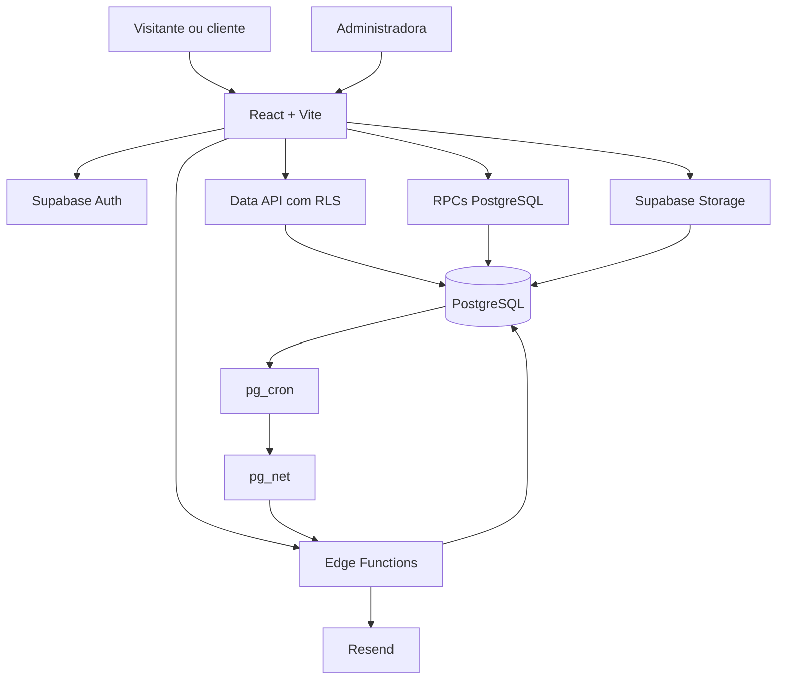
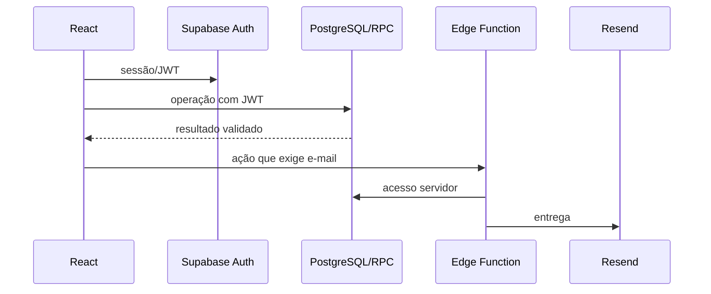

# 02 — Arquitetura

O repositório reúne o frontend React/Vite e os artefatos de backend (`supabase/migrations` e `supabase/functions`). Eles são versionados juntos, mas executam em ambientes diferentes: navegador, PostgreSQL gerenciado e runtime Deno das Edge Functions.

## Escolha do caminho

- **Acesso direto:** consultas e CRUD simples, como catálogo, galeria e telas administrativas, passam pela API do Supabase e dependem de RLS.
- **RPC:** operações atômicas ou com regras, como criar agendamento, revisar pagamento, responder remarcação, liberar agenda e registrar finanças.
- **Edge Function:** envio de e-mail, uso de `service_role` e processamento da fila. O frontend nunca recebe essa chave.
- **Storage:** galeria e promoções usam buckets públicos; comprovantes usam bucket privado e URL assinada para administradores.

Essa estrutura reduz infraestrutura própria e mantém schema, autorização e automações auditáveis em migrations. O custo é exigir cuidado com RLS, grants, secrets e compatibilidade entre frontend e banco.
