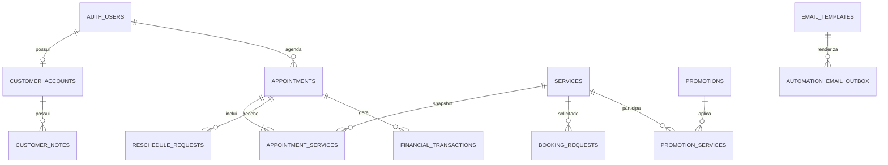

# 03 — Banco de dados

## Experiência diária (local, aguardando aplicação)

`daily_verses` guarda pequenos trechos; `admin_daily_content` fixa a escolha por data e período; `admin_day_reviews` registra uma única revisão por administradora/data. As três tabelas usam RLS administrativa, com leitura individual das revisões.

Esta referência foi obtida das migrations em `supabase/migrations`. Ela descreve o schema versionado, não dados de uma instância remota.

## Tabelas funcionais

| Tabela | Finalidade e campos principais | Relações, acesso e consumidores |
| --- | --- | --- |
| `appointments` | Agendamento: cliente, contato, data/horas, duração, valores, comprovante, pagamento, status e tokens | `user_id` → Auth; leitura/alteração por políticas e RPCs; booking, cliente, agenda, solicitações e financeiro |
| `appointment_services` | Snapshot dos serviços, duração e preço de um agendamento | `appointment_id` → appointments; acompanha as permissões do agendamento |
| `booking_requests` | Solicitação de encaixe, preferências, proposta, validade, comprovante e status | Vincula cliente/serviço e pode originar appointment; cliente e admin por políticas/RPCs |
| `services` | Catálogo: nome, slug, descrição, duração, preço, reserva, imagem, ordem e ativo | Público lê ativos; admin gerencia; referenciado por agendamentos e promoções |
| `gallery_media` | Fotos/vídeos, Storage/URL, legenda, ordem, ativo e destaque central | Público lê ativos; admin gerencia; usa `gallery-media` |
| `monthly_schedule_releases` | Competência mensal, `draft/released/closed`, horários e responsável | Público lê liberadas; admin gerencia e libera por RPC |
| `agenda_blocks` | Bloqueios por data/hora e motivo | Admin gerencia; disponibilidade consulta |
| `special_schedule_hours` | Exceções por data ou dia da semana, abertura, fechamento e ativo | Admin gerencia; disponibilidade consulta |
| `reschedule_requests` | Pedido de remarcação, horário original, preferência/proposta, motivo e status | Cliente lê as próprias; admin gerencia; liga a appointment |
| `request_activity` | Auditoria de ações em solicitações | Leitura administrativa |
| `customer_accounts` | Perfil derivado de Auth, contato, estado ativo e bloqueio | Cliente lê o próprio; admin gerencia |
| `customer_notes` | Anotações administrativas sem exposição à cliente | Admin gerencia; relaciona conta/identidade |
| `customer_notifications` | Notificações individuais e estado de leitura | Cliente lê as próprias |
| `admin_notifications` | Avisos operacionais, conteúdo, referência e leitura | Somente administradores |
| `promotions` | Campanha, tipo/valor, vigência, público, mídia, limites e status | Público lê ativas; admin gerencia |
| `promotion_services` | Associação N:N entre promoção e serviço | Público lê associações de promoções; admin gerencia |
| `promotion_activity` | Auditoria das promoções | Leitura administrativa |
| `financial_transactions` | Recebimentos, taxas, líquido, método, estado e chave idempotente | Admin; liga appointment/cliente; índice único evita reserva duplicada |
| `expenses` | Despesas, categoria, valor, recorrência e exclusão lógica | Admin |
| `financial_activity` | Auditoria financeira | Leitura administrativa |

## Configuração, políticas e e-mail

| Tabela | Finalidade | Acesso |
| --- | --- | --- |
| `studio_settings` | JSON público e privado do estúdio | Público somente via RPC filtrada; admin gerencia |
| `schedule_settings` | Grade semanal, intervalo e lembretes | Público via RPC filtrada; admin gerencia |
| `notification_preferences` | Canais, prioridade e ativação por evento | Admin; Edge Functions consultam no servidor |
| `email_templates` | Assunto, título, corpo, assinatura e variáveis obrigatórias | Admin; servidor renderiza |
| `policy_versions` | Versões de reserva, cancelamento, imagem e endereço | Versão ativa exposta por RPC; admin cria versões |
| `system_settings_activity` | Auditoria das configurações | Leitura administrativa |
| `admin_role_activity` | Promoção/remoção de administradores | Leitura administrativa |
| `email_delivery_logs` | Entrega, falha, provedor, prioridade e `event_key` | Leitura administrativa; escrita servidor |
| `automation_email_outbox` | Fila, tentativas, trava, próxima execução e metadados | Leitura administrativa; RPCs/servidor processam |
| `promotion_email_history` | Uma campanha por cliente/promoção | Leitura administrativa; evita reenvio |
| `daily_content_history` | Conteúdo/versículo já usado em resumos | Leitura administrativa; evita repetição imediata |

Todas as tabelas acima têm RLS habilitado nas migrations. Funções `security definer`, triggers e o cliente servidor executam tarefas não concedidas diretamente ao navegador.

## Funções, gatilhos e controles

As RPCs estão categorizadas em [Backend](05-Backend.md). Gatilhos confirmados: sincronização de conta após mudança em `auth.users`; transação de reserva após pagamento; geração de e-mails após alterações de agendamento, encaixe e remarcação; e guarda contra sobreposição de appointments. Constraints validam durações, valores, horários, tipos e aceite da política.

## Status e valores importantes

Valores confirmados nas migrations e no frontend (há vocabulário legado português/inglês tratado explicitamente):

- Agendamento: `aguardando_pagamento`, `aguardando_aprovacao`, `confirmado`, `cancelado`, `concluido`.
- Pagamento de agendamento: `em_analise`, `confirmado`, `recusado`; integrações também reconhecem `aprovado`, `pago`, `approved`, `refused`, `rejeitado`.
- Encaixe/remarcação: `pendente`, `em_analise`, `aguardando_resposta_cliente`, `proposto`, `aprovado`, `recusado`, `cancelado`, `expirado` e equivalentes ingleses tratados pelas automações.
- Agenda mensal: `draft`, `released`, `closed`.
- Financeiro: `pending`, `received`, `refused`, `refunded`; tipos incluem `reservation`, `partial_payment` e `remaining_payment`.
- Promoção: `draft`, `scheduled`, `active`, `paused`, `ended`, `expired` (conforme constraint; ações manuais aceitam `active`, `paused` e `ended`).
- Outbox: `pending`, `processing`, `sent`, `failed`; logs incluem `sent`, `skipped` e `error`.
- Motivos de bloqueio: `compromisso`, `curso`, `ferias`, `manutencao`, `outro`.

Não normalize esses valores sem migration e plano de compatibilidade: filtros, gatilhos e e-mails dependem deles.

## Beauty Studio 1.0 — feriados e desfechos

A migration `20260804500000_holidays_completion_no_show.sql` prepara `holidays`, metadados de não comparecimento e RPCs administrativas transacionais. Ela permanece local até revisão e autorização de aplicação.
