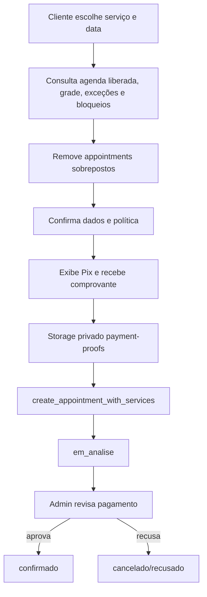
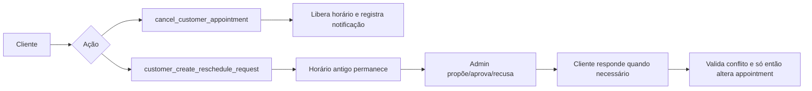
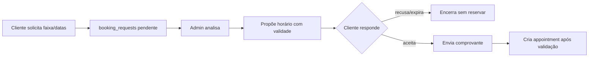
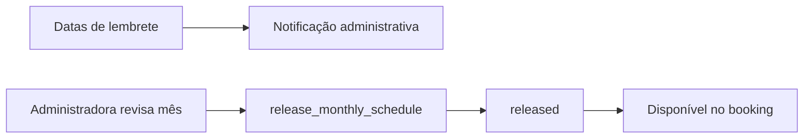

# 06 — Fluxos do sistema

## Detalhes e retorno após login

“Ver detalhes e opções” abre os detalhes do atendimento. Cancelamento e remarcação aparecem somente para estados ativos; concluídos são apenas consultados. Guards preservam `pathname`, query string e hash para retornar à rota originalmente solicitada após o login.

## Início e encerramento do expediente

A abertura mostra conteúdo e indicadores conforme a conta autenticada. O horário apenas libera a ação de revisão: nenhum atendimento é concluído automaticamente. Itens críticos devem ser resolvidos ou mantidos pendentes conscientemente; nova revisão atualiza o mesmo registro.

## Identidade

```mermaid
flowchart LR
    A[Cadastro] --> B[Supabase Auth]
    B --> C[Trigger sincroniza customer_accounts]
    C --> D[Meu Espaço]
    E[Login] --> B
    F[Esqueci a senha] --> G[SMTP do Supabase Auth]
    G --> H[/nova-senha]
    H --> I[Atualiza senha e encerra sessões]
```

Cadastro e login começam na cliente e validam credenciais no Auth. `ProtectedRoute` controla a navegação; RLS/RPC controla dados. Recuperação usa `resetPasswordForEmail`, Redirect URL e o SMTP do Auth. Erros relevantes incluem credencial inválida, sessão ausente/expirada e configuração incorreta de redirect.

## Agendamento, disponibilidade e Pix



A cliente inicia. `get_public_day_availability`, agenda mensal, settings, blocos e appointments calculam disponibilidade; a guarda no banco impede corrida/sobreposição. A criação grava appointment e snapshots em `appointment_services` de forma transacional. Comprovante e política são obrigatórios conforme configuração. A administradora usa `admin_review_payment`; a Edge Function envia o resultado. Erros: mês fechado, slot ocupado, arquivo inválido, política não aceita ou pagamento já analisado.

## Cancelamento e remarcação



Cancelamento valida token/identidade, horário e estado; a taxa de reserva não é reembolsável pela política versionada. Remarcação envolve `reschedule_requests`, `request_activity` e notificações. O horário antigo permanece até aceitação e validação atômica do novo slot. Proposta vencida ou novo conflito exige reanálise.

## Encaixe



O encaixe não reserva horário antes da aceitação. As RPCs validam identidade, serviço, proposta e expiração. `expire_fit_request_proposals` encerra propostas vencidas.

## Atendimento e financeiro

Ao concluir e registrar pagamento, `admin_record_payment` confere saldo, excesso, taxa e `idempotency_key`; insere `financial_transactions`, atualiza o saldo/status e audita em `financial_activity`. O trigger cria uma única transação de reserva recebida por appointment. Despesas usam exclusão lógica.

## Promoções

A administradora configura vigência, público, serviços e limites; `get_active_promotions` retorna somente elegíveis. `promotion_services` aplica o vínculo, `promotion_activity` audita, e a automação registra cada destinatário em `promotion_email_history` para evitar duplicidade.

## Liberação mensal



`monthly_schedule_releases`, `schedule_settings` e horários especiais definem a oferta. A liberação exige administradora e registra quem liberou.

## Serviços e galeria

Admin cria, altera, ordena e pausa serviços/mídias. Serviços com histórico não devem ser excluídos; o frontend verifica vínculos e orienta pausar. Galeria envia arquivo ao bucket público e mantém metadados em `gallery_media`; falhas tentam remover upload órfão. O destaque central é único por atualização coordenada.
# Perfil antes da reserva

Na primeira reserva autenticada, nome e telefone são validados e persistidos por `save_own_customer_profile`, sempre vinculados a `auth.uid()`. Reservas posteriores reutilizam esses dados pessoais. Política de reserva vigente, horário do aceite, autorização de imagem e a versão vigente dessa autorização continuam registrados em cada agendamento.

O sino administrativo abre uma central com contador individual, categorias, estado de leitura e links para o drawer correspondente. Leituras pertencem à administradora autenticada e não ocultam a notificação para a outra conta.

## Navegação da cliente

O drawer direciona para Meu Espaço, Meus Agendamentos e Configurações. O logout encerra a sessão pelo fluxo oficial e retorna a `/entrar`. Agendamentos com múltiplos serviços são agrupados pelo identificador do agendamento.

## Feriados e desfecho manual

A administradora decide se abre, fecha, usa horário especial ou planeja promoção. Atendimentos passados aguardam ação individual: conclusão, não comparecimento ou permanência pendente.
