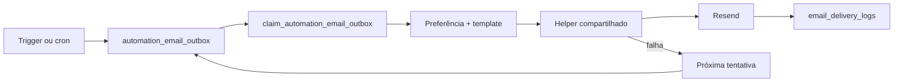

# 07 — Automações e e-mails

O resumo da manhã reutiliza o job `0 10 * * *` e a função `daily-summary`, filtra `daily_summary_email_enabled` e usa `daily-summary:<admin_user_id>:<YYYY-MM-DD>`. `THAIS_ADMIN_EMAIL` permanece fallback. Encerramento não é automático e sua preferência começa desativada.

O **Resend entrega os e-mails do produto**. O **Supabase Auth usa SMTP próprio para recuperação de senha**. As **Edge Functions usam secrets** e `service_role` somente no servidor para os demais e-mails.

Configuração operacional detalhada: [README_EMAIL_SETUP.md](../README_EMAIL_SETUP.md).

## Componentes

- `email_templates`: conteúdo editável, assinatura e variáveis obrigatórias.
- O layout compartilhado usa CSS inline, fundo bege, cartão branco e CTA marrom; assunto, título, subtítulo, corpo, assinatura e botão vêm do template, com fallback somente quando o template solicitado não existe.
- O alerta administrativo de pagamento não inclui chave Pix, anexo ou URL permanente do comprovante. Seu CTA abre a solicitação específica na Central Administrativa por URL assinada apenas sob demanda.
- O pós-atendimento é preparado pelo job `beautyflow-post-service-preparation`; sua operação remota depende da migration aplicada e do job ativo.
- E-mails administrativos consultam `admin_notification_preferences`: somente contas administrativas ativas com e-mail habilitado são destinatárias. `THAIS_ADMIN_EMAIL` é usado apenas como fallback quando a consulta não retorna destinatária válida. Thaís e Laysla mantêm as mesmas permissões de painel; por padrão, somente Thaís é elegível para e-mails.

| Automação | Executor | Frequência | Destinatário | Prevenção de duplicidade | Estado |
|---|---|---|---|---|---|
| Lembrete 24h | `prepare_hourly_automation_emails` + outbox | Horária | Cliente | `reminder-24h:<id>` | Ativa |
| Resumo diário | `daily-summary` | 07:00 São Paulo | Administradora elegível | `daily-summary:<data>` | Ativa |
| Agenda mensal | `prepare_hourly_automation_emails` | Dias 20, 25 e último dia | Administradora elegível | data/event key | Ativa |
| Expiração de encaixe | `expire_fit_request_proposals` | Horária | Cliente e painel | status + event key | Ativa |
| Campanhas | `prepare_promotion_emails` | Diária | Clientes com consentimento | promoção + cliente | Ativa |
| Pós-atendimento | `prepare_post_service_emails` + outbox | Horária, após 2h | Cliente | `post-service:<id>` e `review_email_sent_at` | Implementada; confirmar job remoto |
| Expiração sem comprovante | `expire_unpaid_reservations` | Horária | Painel | status + `reservation-expired:<id>` | Implementada; usa `proof_deadline_minutes` |

Falhas permanecem na outbox com até cinco tentativas e atraso progressivo. A preferência é consultada imediatamente antes do envio. A fila é deliberadamente global: qualquer um dos três executores pode drenar os eventos pendentes, usando o mesmo processador e as mesmas garantias. O nome do worker identifica quem reivindicou o lote, não limita o tipo de e-mail.
- `notification_preferences`: liga/desliga e define prioridade por evento.
- `automation_email_outbox`: fila, trava de worker, tentativas e próxima execução.
- `email_delivery_logs`: status, erro e identificador do provedor.
- `promotion_email_history`: uma campanha por cliente elegível.
- `daily_content_history`: histórico do versículo/conteúdo do resumo.
- `event_key`: chave determinística consultada antes do envio para prevenir duplicidade.

Jobs em processamento há mais de 15 minutos podem ser retomados. Falhas voltam com espera progressiva; após cinco tentativas ficam `failed`. Preferência desativada gera `skipped`, não entrega.

## Automações confirmadas

- Eventos de cadastro, análise/confirmação/recusa de pagamento, cancelamento, encaixe e remarcação.
- Lembrete de atendimento em 24 horas, controlado por `reminder_sent_at`.
- Lembretes de liberação mensal nas datas configuradas.
- Preparação horária da fila e expiração de propostas de encaixe.
- Campanhas promocionais diárias por cliente elegível.
- Resumo diário administrativo com saudação e versículo, evitando repetição pelo histórico.

`pg_cron` chama funções SQL e, via `pg_net`, as Edge Functions `reminders`, `daily-summary` e `promotion-mailer`. As chamadas automáticas exigem o segredo dedicado `AUTOMATION_CRON_SECRET`, enviado pelo header `x-beautyflow-automation-secret`; possuir somente a chave publicável não autoriza executar workers. Os nomes internos dos jobs mantêm “beautyflow”, corretamente, por serem infraestrutura.

## Configuração sem valores

Secrets das Edge Functions: `RESEND_API_KEY`, `PAYMENT_EMAIL_FROM`, `THAIS_ADMIN_EMAIL`, `SITE_URL`, `AUTOMATION_CRON_SECRET`. Secrets do Vault: `beautyflow_project_url`, `beautyflow_publishable_key`, `beautyflow_automation_cron_secret`. O Vault usa chave publicável/anon para o gateway; nunca `service_role`.

O padrão visual pretendido nas migrations de identidade é fundo bege, conteúdo branco, botão marrom, português e assinatura **Thaís Santos Beauty Studio**. Mudanças de template devem preservar variáveis exigidas.

## Lembretes de feriados e não comparecimento

Feriados pendentes geram lembretes idempotentes em 15, 7 e 2 dias. E-mails administrativos respeitam preferências individuais. Não comparecimento enfileira uma comunicação própria à cliente, sujeita à preferência e ao retry existentes.
